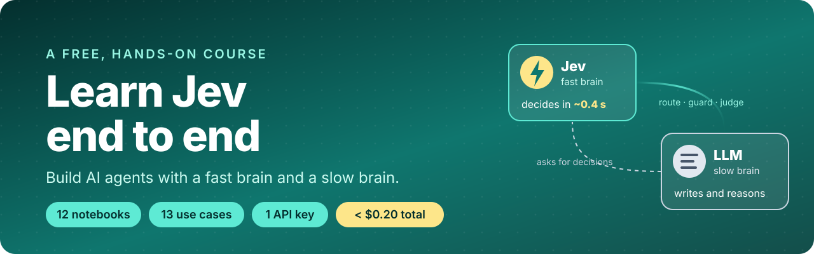

<p align="center">
  <a href="https://harshithsunku.github.io/learn-jev-end-to-end/">
    
  </a>
</p>

<p align="center">
  <a href="https://harshithsunku.github.io/learn-jev-end-to-end/"><b>📖 Read the docs</b></a> ·
  <a href="#-start-in-3-steps"><b>🚀 Quick start</b></a> ·
  <a href="#-the-course"><b>🎓 The course</b></a> ·
  <a href="#-13-things-youll-build"><b>🛠️ Use cases</b></a> ·
  <a href="https://harshithsunku.github.io/learn-jev-end-to-end/benchmarks/"><b>📊 Benchmarks</b></a>
</p>

<p align="center">
  <a href="https://harshithsunku.github.io/learn-jev-end-to-end/"></a>
  <a href=".github/workflows/ci.yml"></a>
  
  
  
  
  <a href="LICENSE"></a>
</p>

---

**Learn Jev end to end** is a free, hands-on course. In 12 short notebooks you go from *"what is Jev?"* to
building **13 real AI tools** with it: an email triage job, a scam-text detector, a code vulnerability
hunter, an agent safety guard and more. You need **one API key**, and running the whole course costs **less
than $0.20**.

## ⚡ Jev in 30 seconds

Most AI apps use one kind of model: an **LLM**, which *writes*. But most of the work inside an AI app isn't
writing. It's **deciding**: *Is this email urgent? Is this command safe? Which tool should I use? Is this
answer correct?*

**[Jev](https://typesafe.ai/blog/introducing-system-one-models-and-jev)** (by TypeSafe AI) is a model built
only for decisions. You give it some text and a question, and you list the answers it's allowed to give. It
picks one and tells you how sure it is:

```python
r = jev.system_one(
    "Help! Payouts have failed for 3 days and my team can't get paid.",
    {"team": Choice(instructions="Which team should handle this?",
                    criteria={"billing": "payments, payouts", "technical": "bugs, outages"})},
)
r.choices["team"].choice          # 'billing'
r.choices["team"].probabilities   # {'billing': 0.99, 'technical': 0.01}
```

That takes about **0.4 seconds** and costs about **$0.00002**. Jev can't invent an answer you didn't list,
and it can't write an essay. That's the point.

## 🧠 The big idea: a fast brain and a slow brain

| | ⚡ **Jev, the fast brain** | 🧠 **LLM, the slow brain** |
|---|---|---|
| **What it does** | decides: yes/no, pick one, score | writes, explains, plans, uses tools |
| **Speed** (our run) | **~0.4 s** | ~2.5-3 s |
| **Cost per 1,000 decisions** (our run) | **~$0.02** | $0.08 (small model) to $1.65 (frontier model) |
| **Can it make things up?** | no, it only picks from *your* answers | yes |

**This course teaches you to combine them.** Jev makes the many small decisions, the LLM does the few
things that need language, and plain code enforces the hard rules. You'll plug Jev into an AI agent at
five places:

<p align="center"></p>

## 🚀 Start in 3 steps

**1. Get one [OpenRouter key](https://openrouter.ai/keys).** It works for both Jev and the LLM.

**2. Clone and set up:**

```bash
git clone https://github.com/harshithsunku/learn-jev-end-to-end.git
cd learn-jev-end-to-end
./setup.sh                       # Windows: .\setup.ps1
```

**3. Paste your key into `.env`, check it, and open the first notebook:**

```bash
uv run python scripts/doctor.py  # checks the LLM, tool calling and Jev
uv run jupyter lab               # open 01_hello_jev.ipynb
```

```text
OK   LLM chat completion                  1169 ms  'pong'
OK   LLM tool calling                      842 ms  get_time({"city":"Paris"})
OK   Jev System One (typesafe)             447 ms  model=typesafe/jev-1.13-20260917  is_scam=0.97  kind=phishing
```

> 💡 **No Jev access yet?** Add `JEV_BACKEND=adapter` to `.env`. Your LLM then answers the same questions,
> and every notebook except the benchmark still runs (we tested it). [More](https://harshithsunku.github.io/learn-jev-end-to-end/guides/no-jev-access/)

## 🎓 The course

Every notebook runs in about a minute, checks itself against labeled data, and prints what it cost. They're
committed **with real outputs**, so you can read them on GitHub or on the
[docs site](https://harshithsunku.github.io/learn-jev-end-to-end/course/) before running anything.

**Pick a path:** ⏱️ *15 min*: 01 → 02 · 🕐 *1 hour*: 01 → 03 → 04 → 07 · 🏆 *weekend*: all 12

| # | Lesson | What you'll learn | What you'll build |
|:-:|---|---|---|
| 01 | [Hello, Jev](01_hello_jev.ipynb) | the three question types, many questions in one call | your first Jev calls, head to head with an LLM |
| 02 | [Jev vs LLMs](02_jev_vs_llm.ipynb) | accuracy, speed, cost, calibration, and Jev's limits | a fair benchmark and a chart |
| 03 | [The agent loop + Jev](03_agent_loop_with_jev.ipynb) | the 5 places Jev fits in an agent | an agent that refuses to cut a core network link |
| 04 | [Email triage job](04_email_triage_job.ipynb) | batch decisions, confidence routing | an inbox triage job that runs on a schedule |
| 05 | [SMS scam shield](05_sms_scam_shield.ipynb) | layering code rules with Jev | a scam-text checker for your family |
| 06 | [Code vulnerability hunter](06_code_vuln_hunter.ipynb) | map with Jev, reduce with the LLM | a scanner that found 9/9 planted bugs |
| 07 | [Guardrails](07_auto_mode_guardrails.ipynb) | action guards, human approval, prompt-injection shields | a shell agent that can't be tricked into leaking data |
| 08 | [Model and tool router](08_model_and_tool_router.ipynb) | picking the cheapest model and the right tools | a router that cuts cost by about half |
| 09 | [On-call log triage](09_oncall_log_triage.ipynb) | counting in code, judging with Jev | an incident summary from raw logs |
| 10 | [RAG relevance and citations](10_rag_relevance_and_citations.ipynb) | filtering sources, checking citations | a docs bot that says "I don't know" |
| 11 | [Jev as judge](11_jev_as_judge_and_evals.ipynb) | grading answers, eval gates in CI | an eval suite cheap enough for every PR |
| 12 | [Capstone: ops copilot](12_capstone_ops_copilot.ipynb) | everything together | a copilot that routes 25 mixed items in ~9 s |

## 🛠️ 13 things you'll build

| | Use case | Jev decides | The LLM does | Result (our run) |
|:-:|---|---|---|---|
| 📧 | **Email triage job** | category, needs a reply?, urgency | drafts replies only where needed | 40 emails in 2.4 s, 92% accurate |
| 📱 | **SMS scam shield** | scam?, which scam, how much pressure | explains the red flags in plain words | 20/20 scams caught, 0 real texts blocked |
| 🐛 | **Code vulnerability hunter** | vulnerability type, really exploitable? | writes the fix, for flagged code only | 9/9 bugs, 0 false alarms |
| 🛡️ | **Agent safety guard** | allow / ask a human / block | the agent's normal work | 14/14 correct decisions |
| 🕵️ | **Prompt-injection shield** | is this text trying to instruct the AI? | never sees quarantined content | hidden attack caught (P=0.99) |
| 🔀 | **Model router** | fast or capable model? | answers on the chosen model | 14/14 correct, 47% cheaper |
| 🧰 | **Tool picker** | which 5 of 48 tools matter? | calls tools from the shortlist | 10/10 right tool, 90% fewer tokens |
| 🚨 | **On-call log triage** | severity, impact, security, SEV level | finds the root cause | 162 log lines → root cause |
| 📚 | **RAG relevance filter** | does this passage help? | answers from good passages only | says "I don't know" when it should |
| 🔎 | **Citation checker** | does the source support this claim? | rewrites unsupported answers | fake citation caught (P=0.02) |
| ⚖️ | **Answer judge and CI evals** | is this answer correct? | nothing | 20/20 agreement with labels |
| ✅ | **"Am I done?" gate** | did it answer every part? | keeps working until it has | 8/8 correct |
| 🤖 | **Ops copilot** | which desk? urgent? needs a human? | the desks do the work | 24/25 routed correctly |

Each one is explained in plain words on the [use cases page](https://harshithsunku.github.io/learn-jev-end-to-end/use-cases/).

## 📊 Real results, not promises

The same questions on the same labeled data, asked to Jev, a small LLM and a frontier LLM
([notebook 02](02_jev_vs_llm.ipynb)):


On the harder 8-way task, **Jev matched the frontier model's accuracy (92%) and was 8x faster and 87x
cheaper.** On the easy task all three were about 100% accurate, and the LLMs were a little more confident.
[Full benchmark, including where the LLMs did better →](https://harshithsunku.github.io/learn-jev-end-to-end/benchmarks/)

## 🧩 Also included

- **A web playground** ([`app.py`](app.py)): try every use case in your browser with `uv run --extra ui python app.py`.
- **A real email job** ([`jobs/email_triage.py`](jobs/email_triage.py)): run it on a schedule against your inbox. It's read-only and never sends mail.
- **A setup doctor** ([`scripts/doctor.py`](scripts/doctor.py)): tells you exactly what's wrong if something doesn't work.
- **A docs site** ([harshithsunku.github.io/learn-jev-end-to-end](https://harshithsunku.github.io/learn-jev-end-to-end/)) with concepts, guides, a cheat sheet and all 12 notebooks.

## ❓ FAQ

<details>
<summary><b>Do I need to know machine learning?</b></summary>
<br>No. If you can read Python and run a Jupyter notebook, you can take this course. There's no training and no GPU.
</details>

<details>
<summary><b>Do I need a TypeSafe account?</b></summary>
<br>No. One OpenRouter key works for both Jev and the LLM. A direct TypeSafe key works too (see the <a href="https://harshithsunku.github.io/learn-jev-end-to-end/reference/configuration/">configuration page</a>).
</details>

<details>
<summary><b>How much does it cost?</b></summary>
<br>About $0.17 to run all 12 notebooks. Most of that is the frontier model in the benchmark. One Jev decision costs about $0.00002.
</details>

<details>
<summary><b>Is it safe to run?</b></summary>
<br>Yes. Every tool is read-only, sandboxed or a dry-run mock. Nothing runs shell commands or sends email. The "vulnerable app" is parsed, never executed.
</details>

<details>
<summary><b>Can I use my own data?</b></summary>
<br>Yes, and you should. Every use case is data plus questions, so you swap both. See <a href="https://harshithsunku.github.io/learn-jev-end-to-end/guides/your-own-data/">Use your own data</a>.
</details>

<details>
<summary><b>When shouldn't I use Jev?</b></summary>
<br>For writing, counting, date math, or as your only security check. The course keeps those in code or with the LLM. See <a href="https://harshithsunku.github.io/learn-jev-end-to-end/learn/when-not-to-use-jev/">When not to use Jev</a>.
</details>

## 📁 What's inside

```text
01_hello_jev.ipynb … 12_capstone_ops_copilot.ipynb    the course, with real outputs
app.py                  web playground (Gradio)
jobs/email_triage.py    scheduled email triage job (read-only IMAP)
scripts/doctor.py       "is my setup working?"
data/                   labeled sample data: emails, texts, tickets, logs, docs, a toy vulnerable app
docs/                   the docs site (MkDocs Material), published to GitHub Pages
```

## 🤝 Contributing

New use cases, fixes and translations are welcome. See [CONTRIBUTING.md](CONTRIBUTING.md).
This course is the sequel to [build-your-first-ai-agent](https://github.com/harshithsunku/build-your-first-ai-agent),
which builds the agent loop that every notebook here reuses.

**If this helped you, please ⭐ the repo** so others can find it.

## 📚 Learn more

[TypeSafe: Introducing System One models and Jev](https://typesafe.ai/blog/introducing-system-one-models-and-jev) ·
[LangChain: Building a harness with Jev](https://www.langchain.com/blog/building-a-harness-with-jev) ·
[TypeSafe docs](https://docs.typesafe.ai/introduction/quickstart) ·
[Jev on OpenRouter](https://openrouter.ai/docs/guides/community/typesafe-sdk)

---

<sub>MIT licensed. An independent community course, not affiliated with TypeSafe AI, OpenRouter or OpenAI.
All numbers come from our run on 2026-09-23 and yours will vary. Run notebook 02 to see your own.</sub>
