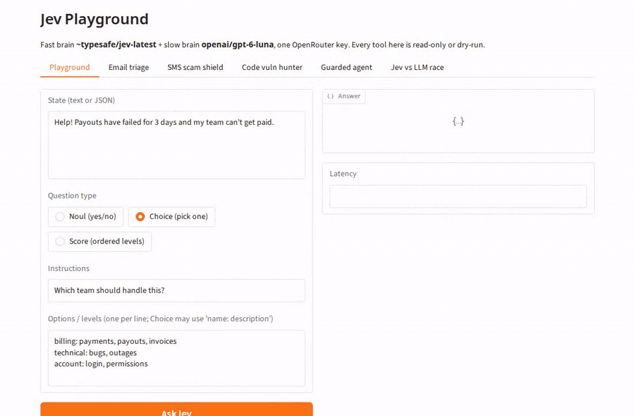
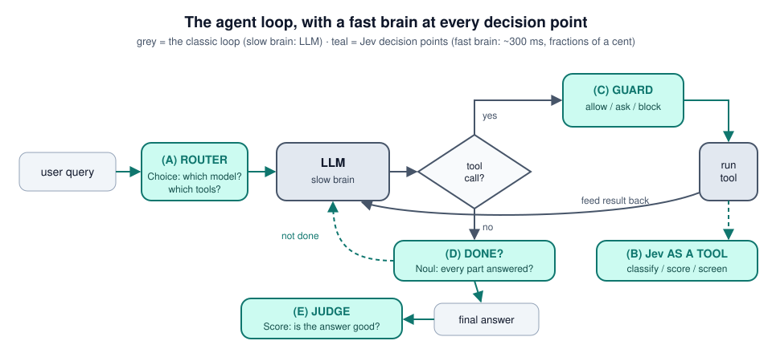
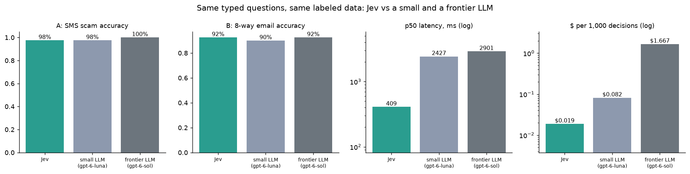

---
hide:
  - navigation
  - toc
---

<div class="hero" markdown>

# Learn Jev end to end

<p class="tagline">A free, hands-on course. Learn <b>Jev</b>, a new kind of AI model built for fast decisions,
and use it to build <b>13 real AI tools</b>, from an email triage job to an agent safety guard.</p>

[Start in 3 steps :material-rocket-launch:](start/index.md){ .md-button .md-button--primary }
[See what you'll build](use-cases/index.md){ .md-button }
[GitHub :fontawesome-brands-github:](https://github.com/harshithsunku/learn-jev-end-to-end){ .md-button }

</div>

<div class="stat-row" markdown>
<div class="stat"><b>12</b>notebooks</div>
<div class="stat"><b>13</b>use cases</div>
<div class="stat"><b>1</b>API key</div>
<div class="stat"><b>~0.4 s</b>per decision</div>
<div class="stat"><b>&lt; $0.20</b>for the whole course</div>
</div>

{ .diagram }
<p style="text-align:center"><small>The Jev Playground (<code>app.py</code>), recorded live in real time.</small></p>

## Jev in 30 seconds

Most AI apps use one kind of model: an **LLM**, which writes text. But most of the work inside an AI app
isn't writing. It's **deciding**: *Is this email urgent? Is this command safe to run? Which tool should I
use? Is this answer correct?*

**Jev** is a model built only for decisions. You give it some text and a question, and you list the answers
it's allowed to give. It picks one and tells you how sure it is.

```python
r = jev.system_one(
    "Help! Payouts have failed for 3 days and my team can't get paid.",
    {"team": Choice(instructions="Which team should handle this?",
                    criteria={"billing": "payments, payouts", "technical": "bugs, outages"})},
)
r.choices["team"].choice         # -> 'billing'
r.choices["team"].probabilities  # -> {'billing': 0.99, 'technical': 0.01}
```

That call takes about **0.4 seconds** and costs about **$0.00002**. Jev can't invent an answer you didn't
list, and it can't write an essay. That's the point.

## The big idea: a fast brain and a slow brain

| | :zap: **Jev, the fast brain** | :brain: **LLM, the slow brain** |
|---|---|---|
| **What it does** | makes decisions: pick, score, yes/no | writes, explains, plans, uses tools |
| **Speed** (our run) | ~0.4 s | ~2.5-3 s |
| **Cost per 1,000 decisions** (our run) | ~$0.02 | $0.08 (small) to $1.67 (frontier) |
| **Can it make things up?** | no, it only picks from *your* answers | yes |

**This course teaches you to combine them:** Jev makes the many small decisions, and the LLM does the few
things that need language. You'll plug Jev into an AI agent at five places:

{ .diagram }

## What you'll build

<div class="grid cards" markdown>

-   :material-email-fast: **Email triage job**

    ---

    Sort a whole inbox in seconds. The LLM drafts replies only for the emails that need one.

    [Notebook 04](course/04_email_triage_job.ipynb)

-   :material-cellphone-message: **SMS scam detector**

    ---

    Catch "unpaid toll" and "Hi mum, new number" scams, and explain them in plain words.

    [Notebook 05](course/05_sms_scam_shield.ipynb)

-   :material-bug-check: **Code vulnerability hunter**

    ---

    Check every function for SQL injection, leaked secrets and more. The LLM only reads the suspicious ones.

    [Notebook 06](course/06_code_vuln_hunter.ipynb)

-   :material-shield-check: **Agent safety guard**

    ---

    Block risky commands, ask a human for the grey areas, and quarantine hidden prompt injections.

    [Notebook 07](course/07_auto_mode_guardrails.ipynb)

-   :material-call-split: **Model and tool router**

    ---

    Send each request to the cheapest model that can handle it, and give the LLM 5 tools instead of 48.

    [Notebook 08](course/08_model_and_tool_router.ipynb)

-   :material-robot-happy: **Ops copilot (capstone)**

    ---

    One inbox of emails, scam reports, code, alerts and questions, each routed to the right handler.

    [Notebook 12](course/12_capstone_ops_copilot.ipynb)

</div>

[See all 13 use cases :material-arrow-right:](use-cases/index.md){ .md-button }

## Real results, not promises

Every notebook in this course measures itself against labeled data and prints what it cost.
Here is the head-to-head from [notebook 02](course/02_jev_vs_llm.ipynb):



On the harder 8-way email task, Jev matched the frontier model's accuracy (92%) and was **7x faster and
88x cheaper** than it. On the easy scam task all three models were about 98-100% accurate.
[Read the full benchmark, including where the LLMs did better](benchmarks.md).

## Who is this for?

- **Developers who know a little Python** and want to build useful AI tools, not just chatbots.
- **People building agents** who want them faster, cheaper and safer.
- **Anyone curious about Jev** who wants to see what it's actually good at, and what it isn't.

You don't need machine-learning experience. If you can run a Jupyter notebook, you can take this course.

[Start in 3 steps :material-rocket-launch:](start/index.md){ .md-button .md-button--primary }
